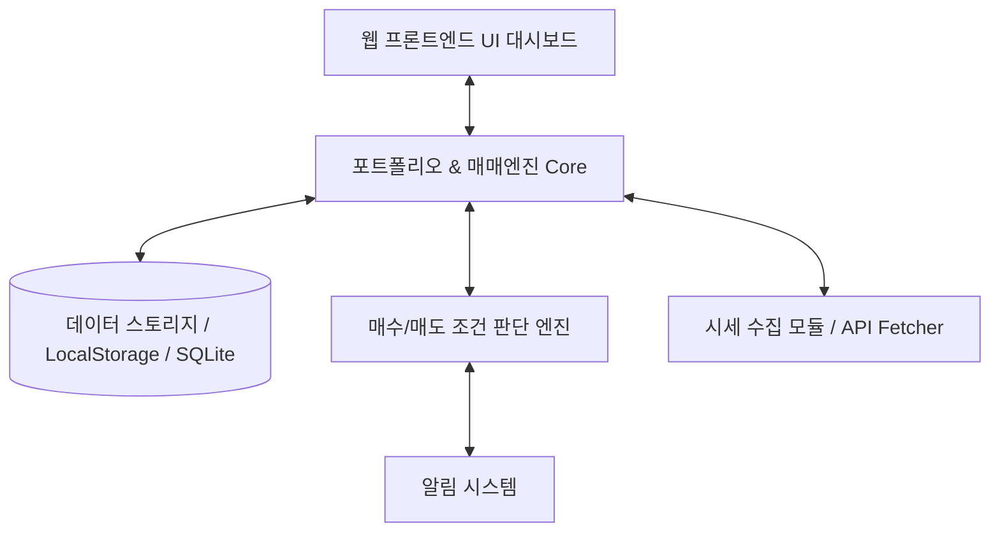

# [PRD 및 구현 계획] 투자종목별 실적 관리 및 매수/매도 시점 알림 프로그램

사용자가 보유한 주식/투자 종목의 현황을 실시간(또는 주기적)으로 추적하고, 종목별 공통 매매 로직에 따른 설정 변수 기반 매수/매도 알림을 제공하며, 실제 거래 내역을 기록하여 지속적인 포트폴리오 관리가 가능하도록 돕는 프로그램 구축 계획입니다.

---

## 1. 제품 요구사항 정의서 (PRD - Product Requirement Document)

### 1.1 개요 및 목적
- **목적**: 종목별 투자실적을 한눈에 파악하고, 사전 정의된 조건식(알고리즘)과 종목별 변수 설정에 따라 최적의 매수/매도 시점 알림을 제공하여 투자 수익률을 극대화 및 체계적 관리.
- **핵심 가치**: 
  - 체계적인 포트폴리오 관리 (평단가, 총투자금, 평가손익, 수익률)
  - 감정을 배제한 조건 기반 매수/매도 알림 (전략 변수 개별화)
  - 거래 내역(매수/매도) 입력을 통한 실시간 실적 업데이트 및 지속적 피드백

### 1.2 주요 기능 명세 (Functional Requirements)

1. **보유 종목 현황 대시보드 (Portfolio Dashboard)**
   - 종목별 보유 수량, 평균 단가(평단가), 총 매수금액, 현재가, 평가금액, 평가손익, 수익률(%) 표시
   - 전체 포트폴리오 요약 (총 자산, 총 투자금, 누적 실현손익, 미실현 평가손익)

2. **실제 매수 / 매도 내역 입력 및 실적 반영 (Transaction Journal & Accounting)**
   - 매수/매도 거래 입력 Form (일시, 종목코드/명, 거래 유형[매수/매도], 수량, 단가, 수수료/세금)
   - 이동평균법(또는 선입선출법) 기반 평단가 재계산 및 실현손익(Realized PnL) 자동 집계
   - 히스토리 조회 및 수정/삭제 기능

3. **매수 / 매도 시점 알림 엔진 (Signal & Alert Engine)**
   - **공통 알고리즘 뼈대**: 모든 종목에 기본적으로 동일하게 적용되는 매매 알고리즘 파이프라인 구축 (예: VR[Value Rebalancing], 변동성 돌파, RSI/이동평균선 등 전략 확장성 보유)
   - **종목별 파라미터(변수) 설정 기능**:
     - 종목별 목표가, 손절가 비율, 리밸런싱 주기, 매수/매도 분할 비중 등 개별 파라미터 셋팅 지원
   - **알림 기능**: 조건 충족 시 UI 팝업, 사운드, 브라우저 알림 (향후 텔레그램/이메일 연동 확장 가능)

4. **종목 및 매매 조건 설정 관리 (Strategy Settings)**
   - 종목 추가/수정/삭제
   - 종목별 매매 전략 변수(매수 조건 threshold, 매도 조건 threshold, 목표 비중 등) 설정 폼 제공
   - 추후 사용자가 제공할 세부 매매 조건식을 유연하게 반영할 수 있는 모듈식/구조화된 코드 설계

---

## 2. 필요 스킬 및 에이전트 구성 안내

이 시스템을 완벽하게 구현하고 유지보수하기 위해 필요한 전문 에이전트 및 기능 모듈(스킬) 구성입니다.

### 2.1 필요한 에이전트 (Subagents / Roles)

1. **포트폴리오 & 금융 계산 전문 에이전트 (Financial Logic Agent)**
   - 역할: 매수/매도에 따른 평단가 계산, 실현손익, 평가손익, 수수료 고려 수익률 정확한 산출 logic 검증
2. **매매 알고리즘 및 알림 엔진 에이전트 (Strategy Engine Agent)**
   - 역할: 사용자가 제공할 매수/매도 조건식을 파라미터화하고, 시세 데이터 변동 시 실시간/주기적으로 조건 충족 여부를 계산하여 신호(Signal) 발생
3. **웹 UI / UX 개발 에이전트 (Modern Web Dashboard Agent)**
   - 역할: 직관적이고 시각적으로 우수한 반응형 대시보드(차트, 표, 입력 폼, 알림 트레이) 구축
4. **시세 데이터 수집 에이전트 (Market Data Fetcher Agent)**
   - 역할: 국내/해외 주식 시세 데이터(Open API 또는 Web Scraping/Polling) 수집 및 캐싱 처리

### 2.2 필요한 주요 스킬 & 기술 스택 (Skills & Tech Stack)

- **Frontend / UI**: HTML5, Vanilla CSS (Modern CSS / Dark Mode / Glassmorphism), JavaScript (ES6+) 또는 Vite Single-Page Dashboard
- **Data Persistence**: 브라우저 `localStorage` / `IndexedDB` (로컬 완결형 저장) 또는 Python SQLite 백엔드
- **Chart & Visualization**: Chart.js / Lightweight Charts (주가 흐름 및 포트폴리오 비중 시각화)
- **Signal Engine**: 모듈형 Strategy Pattern (조건식 Interface 정의 후 종목별 파라미터 Object 주입 방식)

---

## 3. 제안하는 개발 단계 (Roadmap)

### Phase 1: 기본 프론트엔드 대시보드 및 포트폴리오 데이터 구조 셋팅
- [x] PRD 작성 및 시스템 구조 정의 (완료)
- [ ] HTML/CSS/JS 기반의 현대적이고 직관적인 웹 대시보드 인터페이스 제작
- [ ] 보유 종목 리스트, 평가금액/수익률 요약 카드, 매매일지 입력 팝업 UI 작성

### Phase 2: 매수/매도 내역 입력 및 평단가/실적 자동 연산 로직 구현
- [ ] 실제 매수/매도 내역 입력 폼 구현 (날짜, 종목, 수량, 단가, 수수료 등)
- [ ] 거래 발생 시 평단가 및 보유 수량, 실현손익 자동 계산 알고리즘 작성
- [ ] 로컬 스토리지 데이터 저장 및 복원 기능

### Phase 3: 종목별 매매 조건 설정 및 알림 엔진 구현
- [ ] 공통 매매 조건 엔진 (Interface) 설계
- [ ] 종목별 파라미터(매수/매도 기준 변수) 설정 인터페이스 구현
- [ ] 현재가 기준 매수/매도 시점 조건 체크 및 알림 발생 (브라우저 알림/UI 뱃지)

### Phase 4: 사용자 조건식 최종 반영 및 시세 데이터 연동 테스트
- [ ] 사용자가 제공하는 세부 매수/매도 조건식 로직 코딩 및 반영
- [ ] 시세 업데이트 기능 연동 및 시뮬레이션 검증

---

## 4. 사용자 검토 및 확인 필요 사항 (User Review Required)

> [!IMPORTANT]
> **매매 조건식 관련**: 종목별 셋팅 조건식의 기본 구조(예: VR 매매법, 손익절 퍼센트, 이동평균선 등)가 마련되면 코드에 바로 반영할 수 있도록 모듈화 인터페이스 형태로 먼저 구성할 예정입니다.

> [!NOTE]
> **시세 데이터 공급 방식**: 
> 1) 테스트용 수동 현재가 입력/가상 시세 시뮬레이터 제공
> 2) 한국투자증권 API / Yahoo Finance 등 외부 시세 API 연동 가능 (API키 필요 여부 확인 필요)

---

## 5. 검증 계획 (Verification Plan)

### 마이그레이션 & 기능 검증
1. **거래 내역 계산 정확도 검증**: 매수/매도 다회 실행 시 평단가 및 수익률 연산 결과 테스트
2. **알림 엔진 동작 검증**: 임의의 현재가 변동 시 조건에 맞춰 정확하게 매수/매도 알림이 트리거되는지 검증
3. **UI/UX 반응성 검증**: 브라우저 대시보드 내 모달, 알림 토스트, 데이터 표 렌더링 확인
